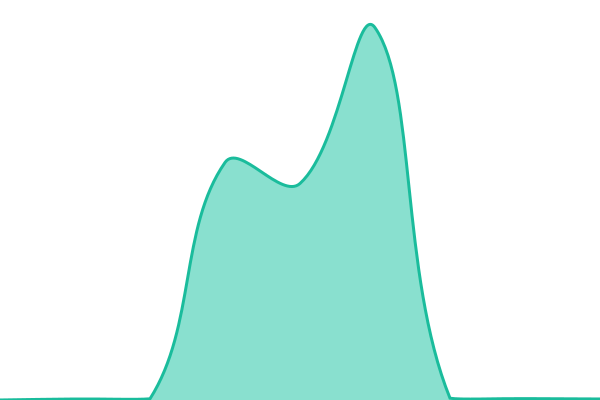

# [📈 Live Status](https://Rashi228.github.io/ims-status): <!--live status--> **🟥 Complete outage**

This repository contains the open-source uptime monitor and status page for [Rashi228](https://Rashi228.github.io/ims-status), powered by [Upptime](https://github.com/upptime/upptime).

With [Upptime](https://upptime.js.org), you can get your own unlimited and free uptime monitor and status page, powered entirely by a GitHub repository. We use [Issues](https://github.com/Rashi228/ims-status/issues) as incident reports, [Actions](https://github.com/Rashi228/ims-status/actions) as uptime monitors, and [Pages](https://Rashi228.github.io/ims-status) for the status page.

<!--start: status pages-->
<!-- This summary is generated by Upptime (https://github.com/upptime/upptime) -->
<!-- Do not edit this manually, your changes will be overwritten -->
<!-- prettier-ignore -->
| URL | Status | History | Response Time | Uptime |
| --- | ------ | ------- | ------------- | ------ |
|  [Frontend UI Portal](https://ims-frontend-1053994989870.us-central1.run.app) | 🟥 Down | [frontend-ui-portal.yml](https://github.com/Rashi228/ims-status/commits/HEAD/history/frontend-ui-portal.yml) | 

 321ms
     
 | 

<a href="https://Rashi228.github.io/ims-status/history/frontend-ui-portal">99.99%</a>
    

|  [Backend API Server](https://ims-backend-1053994989870.us-central1.run.app/docs) | 🟥 Down | [backend-api-server.yml](https://github.com/Rashi228/ims-status/commits/HEAD/history/backend-api-server.yml) | 

 9167ms
     
 | 

<a href="https://Rashi228.github.io/ims-status/history/backend-api-server">99.99%</a>
    

|  [Supabase Database (Deep Check)](https://ims-backend-1053994989870.us-central1.run.app/health) | 🟥 Down | [supabase-database-deep-check.yml](https://github.com/Rashi228/ims-status/commits/HEAD/history/supabase-database-deep-check.yml) | 

 2401ms
     
 | 

<a href="https://Rashi228.github.io/ims-status/history/supabase-database-deep-check">100.00%</a>
    

<!--end: status pages-->

[**Visit our status website →**](https://Rashi228.github.io/ims-status)

## 📄 License

- Powered by: [Upptime](https://github.com/upptime/upptime)
- Code: [MIT](./LICENSE) © [Anand Chowdhary](https://anandchowdhary.com)
- Data in the `./history` directory: [Open Database License](https://opendatacommons.org/licenses/odbl/1-0/)
